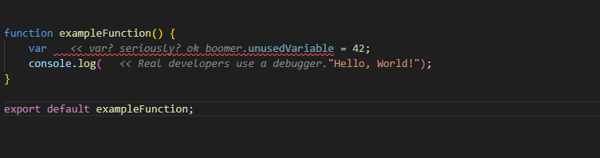

# Roast

**A linter that hurts your feelings.**

Roast is a VS Code extension that provides real-time, humorous "roasts" for common coding anti-patterns. It uses ghost text to inject witty comments next to problematic code, making code review both educational and entertaining.



## Features

- **Real-time Roasting**: Get instant feedback on code anti-patterns as you type
- **Smart Detection**: Identifies common issues like `var` usage, `console.log`, `any` types, and more
- **Achievement System**: Unlock achievements as you accumulate roasts (10, 50, 100, 500)
- **Configurable Rules**: Enable/disable specific roast rules to your preference
- **Performance Optimized**: Debounced updates and file size limits prevent lag
- **Language-Specific**: TypeScript rules only run on TypeScript files
- **Statistics Tracking**: View your roast count and most common violations

## What Gets Roasted

### Anti-Patterns
### Anti-Patterns
- **`var` keyword**: "What is this, 2015? Use let/const."
- **`any` type**: "'any'? just say you gave up."
- **`==` instead of `===`**: "Type coercion is not your friend."
- **`eval()` usage**: "eval() is evil."
- **`dangerouslySetInnerHTML`**: "Living life on the edge."
- **Index as key**: "Enjoy your weird re-renders."

### Code Smells
- **`console.log`**: "don't forget to delete this."
- **Empty catch blocks**: "Error handling: 404 not found."
- **Deep nesting**: "You are building a pyramid, not a feature."
- **Hardcoded secrets**: "I'm stealing this."
- **Unsecure HTTP**: "Welcome to 1995. Use HTTPS."

### Procrastination
- **TODO comments**: "You and I both know you won't do this."
- **Roast of the Day**: A daily dose of humor on startup.

## Installation

### From Marketplace (Coming Soon)
1. Open VS Code
2. Go to Extensions (Ctrl+Shift+X)
3. Search for "Roast"
4. Click Install

## Usage

### Basic Usage
1. Install the extension
2. Open any JavaScript or TypeScript file
3. Write some questionable code
4. Watch the roasts appear as grey italic text to the right

### Commands

- **Toggle Roast Mode**: `Ctrl+Shift+P` → "Roast: Toggle Roast Mode"
- **Show Statistics**: `Ctrl+Shift+P` → "Roast: Show Statistics"

### Status Bar

Click the status bar item (Roasts: X) to quickly toggle roast mode on/off.

## Configuration

Access settings via `File > Preferences > Settings` and search for "Roast".

### Available Settings

```json
{
  // Enable or disable VS Roast
  "vsRoast.enabled": true,
  
  // Delay before updating roasts (ms)
  "vsRoast.debounceDelay": 500,
  
  // Max file size to scan (bytes)
  "vsRoast.maxFileSize": 100000,
  
  // Enable/disable specific rules
  "vsRoast.rules": {
    "varUsage": true,
    "consoleLog": true,
    "anyType": true,
    "todoComments": true,
    "deepNesting": true,
    "longFunctions": true,
    "looseEquality": true,
    "magicNumbers": true
  }
}
```

## 🏆 Achievements

Unlock achievements as you accumulate roasts:

- 🥉 **Rookie Mistakes** (10 roasts)
- 🥈 **Code Smell Collector** (50 roasts)
- 🥇 **Anti-Pattern Enthusiast** (100 roasts)
- 🔥 **Officially Dangerous** (500 roasts)

## Examples

### Before Roast
```typescript
var x = 10;
console.log(x);

function test(data: any) {
    // TODO: Fix this later
    if (true) {
        if (true) {
            if (true) {
                console.log("Too deep!");
            }
        }
    }
}
```

### After Roast
```typescript
var x = 10; << var? seriously? ok boomer.
console.log(x); << classic debugger technique.

function test(data: any) { << 'any'? just say you gave up.
    // TODO: Fix this later << Ticket #NEVER-HAPPENING
    if (true) {
        if (true) {
            if (true) { << You are building a pyramid, not a feature.
                console.log("Too deep!"); << don't forget to delete this.
            }
        }
    }
}
```

## License

MIT License - feel free to use this in your projects!

## Acknowledgments

- Inspired by the countless code reviews that roasted my code
- Built with the VS Code Extension API
- Thanks to all developers who write questionable code (we all do)


**Remember**: Roast is meant to be fun and educational. If you're offended by your code being roasted, maybe it's time to refactor! 😄

Made with 🔥 and ❤️ by developers, for developers.
